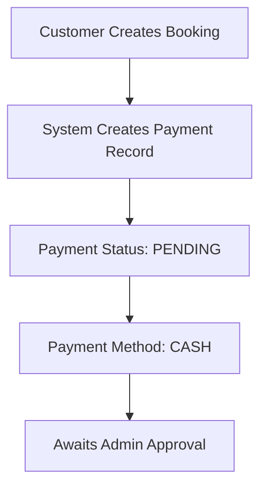
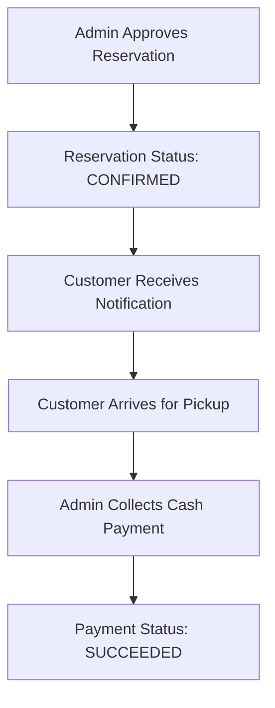
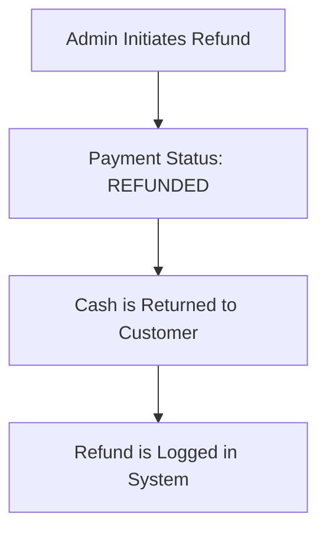

# Cash-Only Payment Model Documentation

## Overview

MotoRent has been simplified to use **CASH-ONLY** payment processing. All motorcycle rentals are paid in cash during the pickup process at the shop location. This eliminates the need for online payment processors and simplifies the financial management.

## Payment Flow

### 1. Reservation & Payment Booking

When a customer completes a booking:



- **Initial Status**: `pending`
- **Payment Method**: `cash`
- **No online processing** - no Stripe integration, no payment gateway

### 2. Admin Approval & Collection

When admin approves the reservation:



- Admin confirms all documents are valid
- Customer arrives at pickup location on scheduled date/time
- **Payment is collected physically** at the shop
- Admin marks payment as completed in system

### 3. Payment Refunds

For cancellations or damage refunds:



- Admin can process full or partial refunds
- Cash is handed back to customer physically
- System records refund details for accounting

## Database Schema

### Payment Record (payments table)

```sql
CREATE TABLE payments (
  id UUID PRIMARY KEY,
  reservation_id UUID NOT NULL REFERENCES reservations(id),
  user_id UUID NOT NULL REFERENCES users(id),
  amount DECIMAL(10,2) NOT NULL,
  currency VARCHAR(3) DEFAULT 'PHP',
  status VARCHAR(50) NOT NULL DEFAULT 'pending',
  payment_method VARCHAR(50) NOT NULL DEFAULT 'cash' 
    CHECK (payment_method = 'cash'),
  
  -- Cash payment specific
  paid_at TIMESTAMP,
  
  -- Refund tracking
  refund_amount DECIMAL(10,2),
  refund_reason TEXT,
  refunded_at TIMESTAMP,
  
  -- Legacy Stripe fields (unused in cash mode)
  stripe_payment_intent_id VARCHAR(255),
  stripe_charge_id VARCHAR(255),
  stripe_refund_id VARCHAR(255),
  
  metadata JSONB,
  created_at TIMESTAMP DEFAULT now(),
  updated_at TIMESTAMP DEFAULT now()
);
```

### Payment Statuses

| Status | Meaning | When Used |
|--------|---------|-----------|
| `pending` | Payment awaiting collection | Reservation confirmed, customer not yet arrived |
| `succeeded` | Cash collected | Admin confirmed payment received at pickup |
| `failed` | Payment not collected | Rare - only if collection was unsuccessful |
| `cancelled` | Reservation was cancelled | Before payment was collected |
| `refunded` | Full refund processed | After damage/incident refund is given back |
| `partially_refunded` | Partial refund (damage deposit) | Damage found, deposit partially returned |

## Implementation Details

### Payment Service (src/services/paymentService.ts)

```typescript
// Create payment record for reservation
const createPaymentIntent = async (params: {
  reservationId: string;
  userId: string;
  amount: number;
  currency?: string;
  metadata?: Record<string, any>;
}): Promise<{ payment: Payment }>;

// Confirm payment was received (admin only)
const processPayment = async (paymentId: string): Promise<Payment>;

// Process refund
const refundPayment = async (
  paymentId: string,
  amount?: number,
  reason?: string
): Promise<Payment>;
```

**Key Points:**
- No Stripe integration
- No payment method selection (always 'cash')
- Simple status tracking
- Direct database updates

### Transaction Tracking

The `transactionService` automatically syncs payment status with transaction records:

```typescript
// Sync both transaction and payment records
await transactionService.syncTransactionAndPaymentStatus(
  reservationId,
  'completed' // Status when admin confirms payment
);
```

## Payment Amounts

### Breakdown per Rental

```
Subtotal (Daily Rate × Days)    = ₱X,XXX
Security Deposit (20%)           = ₱  XXX
─────────────────────────────────────────
Total Due at Pickup              = ₱X,XXX
```

**Security Deposit:**
- Held as part of payment
- Refunded after motorcycle return and inspection
- Deducted if damage is found

**Example:**
- Motorcycle: ₱2,000/day
- Rental: 3 days
- Subtotal: ₱6,000
- Deposit (20%): ₱1,200
- **Total: ₱7,200 (cash at pickup)**

## Admin Dashboard

### Payment Management

Admins can view all payments in the Admin Dashboard:

1. **Pending Payments** - Awaiting collection
2. **Collected Payments** - Successfully paid
3. **Refunded Payments** - Returned to customer

```
┌─────────────────────────────────────────┐
│        PAYMENT STATISTICS               │
├─────────────────────────────────────────┤
│ Total Payments:        45               │
│ Collected (succeeded): 38               │
│ Pending:              5                 │
│ Total Revenue:        ₱125,400          │
│ By Method:            100% Cash         │
└─────────────────────────────────────────┘
```

## Key Benefits

✅ **Simplicity** - No complex payment gateway integration  
✅ **Lower Fees** - No payment processing fees (no Stripe, GCash, etc.)  
✅ **Direct Control** - Cash physically at location  
✅ **Instant Settlement** - No waiting for online payments  
✅ **Customer Familiar** - Cash payments are familiar to most users  
✅ **Less Technical Risk** - No PCI compliance concerns  

## Limitations

❌ **Customer Arrival Required** - Must come to shop to pay  
❌ **No Online Payment** - Cannot prepay online  
❌ **No Advance Confirmation** - Can only confirm after payment  
❌ **Cash Handling** - Shop must handle cash logistics  

## Security Notes

- No credit card data stored in system
- No Stripe secret keys in codebase
- No payment gateway vulnerabilities
- Cash handling security is physical/operational concern

## Migration from Multi-Method to Cash-Only

The codebase was updated with migration `022_cash_only_payment.sql`:

**Changes Made:**
1. Updated `payment_method` constraint to only allow `'cash'`
2. Updated default to `'cash'`
3. Existing 'card' and 'gcash' entries converted to 'cash'
4. Removed Stripe integration from frontend
5. Removed createPaymentIntent function from components
6. Simplified paymentService.ts to cash-only operations

**Files Modified:**
- `src/services/paymentService.ts` - Removed card/online payment logic
- `src/components/BookingPage.tsx` - Removed payment method selector
- `src/components/admin/AdminReservations.tsx` - Removed Stripe imports
- `supabase/migrations/022_cash_only_payment.sql` - Database constraint update

**Removed Imports:**
- Stripe.js library (no longer needed)
- Payment gateway packages
- Online payment processors

## Testing the System

### Manual Testing Checklist

- [ ] Customer can complete booking flow
- [ ] Payment status shows as 'pending' after booking
- [ ] Admin can see pending payments
- [ ] Admin can mark payment as 'succeeded'
- [ ] Admin can process refunds
- [ ] Payment history shows in customer profile
- [ ] Transaction records sync correctly

### Payment Test Scenario

1. **Customer Books:**
   - Select motorcycle
   - Fill dates & documents
   - Reach payment step
   - Only "Cash Payment" option shown
   - Confirm booking

2. **Admin Reviews:**
   - Check reservation in Admin Dashboard
   - Verify documents
   - Approve reservation

3. **Customer Arrives:**
   - Comes to pickup location at scheduled time
   - Admin collects cash (₱total amount)
   - Admin confirms payment in system

4. **Confirmation:**
   - Payment status changes to 'succeeded'
   - Transaction record created
   - Confirmation email sent
   - Reservation status: completed

## Future Enhancements

Possible future improvements:

- **GCash Integration** - Add if needed (separate from cash)
- **Payment Receipt Printing** - Generate cash receipts
- **Payment Analytics** - Dashboard charts for cash flow
- **Accounting Export** - Export payment data for accountant
- **Multiple Payment Locations** - Support branch office payments

## Questions?

For questions about the cash-only payment system:

1. Check this document first
2. Review `src/services/paymentService.ts` for implementation details
3. See `supabase/migrations/022_cash_only_payment.sql` for database schema
4. Check admin guides in `src/ADMIN_GUIDE.md`

---

**Last Updated:** January 15, 2025  
**Payment System Version:** Cash-Only v1.0  
**Status:** Production Ready
